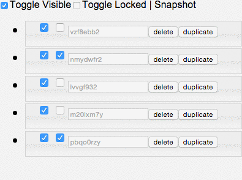

React UI : Layers Panel
=======================

It's a Photoshop-liked layers pannel (build on [React](https://github.com/facebook/react) / [Flux](https://github.com/facebook/flux)) supporting **SORT** / **HIDE** / **LOCK** / **DELETE** / **DUPLICATE** layers. I assume you're already familiar with [React](https://github.com/facebook/react) and [Flux](https://github.com/facebook/flux). Check them out if you're not.

> This project is still young. Feel free to correct me if there're wrong/bad codes.

Demo
----



[demo](https://dl.dropboxusercontent.com/u/3587501/react/ui/layers-panel/index.html)

Usage
-----

Before creating component you should create `layers store` for the componenet. The store is a JSON array indicating the properties of a layer. Of course you can share the store among different React components.

```
var createLayerStore = require('react-ui-layers-panel').createLayerStore;
var store = createLayerStore([{isVisible: true, isLocked: false, snapshot: SVGSVGElement}]);

```

> Note: I'm still working on publishing it to the NPM. Before that, you might not be able to use `require('react-ui-layers-panel')`.


Complete Example:

```
var LayersPanel = require('react-ui-layers-panel').LayersPannel;
var createLayerStore = require('react-ui-layers-panel').createLayerStore;

// Initialize the store for the LayerPanel.
var store = createLayerStore([{isVisible: true, isLocked: false, snapshot: 1111},
                            {isVisible: false, isLocked: true, snapshot: 2222},
                            {isVisible: false, isLocked: false, snapshot: 3333},
                            {isVisible: true, isLocked: false, snapshot: 4444},
                            {isVisible: false, isLocked: true, snapshot: 5555}]);

React.render(
  <LayerPanel store={store} />,
  document.getElementById('react-example')
);
```

Actually `require('react-ui-layers-panel')` returns an object containing the `store` and `action` properties. You could use `action` to apply changes to layers and get layer's properties through `store`.

> Note: You **SHOULD NOT** change the layer store directly. Or it will break the logic and make the whole system inconsistent.


Layer Store API
---------------
Layer object is very simple, it only has few properties. These are properties you'd care.

```
{
  id: 123,
  isVisible: true,
  isLocked: false,
  snapshot: SVGSVGElement 
}
```

Useful APIs:

```
/**
 * @param {Integer} token - The token(or index) of the layer in store you want.
 * @return {Object} - The layer object.
 */
getLayerState(token)
```

```
/**
 * @return {Array} - The array of all layer objects.
 */
getAll()
```

```
/**
 * @return {Integer} - The total amount of layers.
 */
length()
```

```
/**
 * @param {Function} callback - The callback function subscribed for layer change.
 */
listen(callback)
```

```
/**
 * @param {Function} callback - The callback function subscribed for layer change.
 */
unlisten(callback)
```

Layer Action API
----------------

The APIs you'd care:

```
/**
 * @param {Integer} token - The position of the layer in store you want to insert.
 * @param {Boolean} isVisible - Whether the layer is visible or not.
 * @param {Boolean} isLocked - Whether the layer is locked or not.
 * @param {SVGSVGElement} snapshot - The SVG element.
 */
insertLayer(token, isVisible, isLocked, snapshot)
```

```
/**
 * @param {Integer} token - The token(or index) of the layer in store you want to delete.
 */
deleteLayer(token)
```

```
/**
 * @param {Integer} token - The token(or index) of the layer in store you want to change.
 * @param {Boolean|undefined} isVisible - Whether the layer is visible or not. Won't change if undefined.
 * @param {Boolean|undefined} isLocked - Whether the layer is locked or not. Won't change if undefined.
 */
setLayerState(token, isVisible, isLocked)
```

```
/**
 * @param {Integer} token - The token(or index) of the layer in store you want to duplicate.
 */
duplicateLayer(token)
```

```
/**
 * @param {Integer} from - The 1st position of the layer you want to exchange with.
 * @param {Integer} to - The 2nd position of the layer you want to exchange with.
 */
exchangeLayers(from, to)
```


